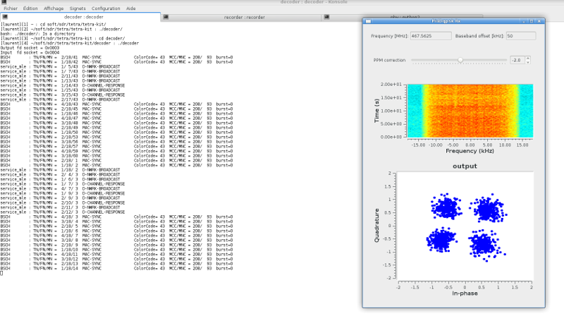

# Tetra-kit

TETRA downlink decoder/recorder kit



Generalities
============

This project aim is to provide an extensible TETRA downlink receiver kit for RTL-SDR dongle with following ideas:
- Stays as close as possible to TETRA specification layers defined in `ETSI EN 300 392-2 v3.4.1
(2010-08)`
- Transmit downlink informations (including speech frames) in Json plain text format to be recorded or analyzed
by an external program
- Reassociate speech frames with a simple method based on associated `caller id` and `usage marker` (save messages transmitted simultaneously in separated files)

The decoder implements a soft synchronizer allowing missing frames (50 bursts) before loosing synchronization.

Workflow
========

The decoder get physical layer bits from gnuradio PI/4 DQPSK receiver and transmit TETRA downlink
informations in Json format to be analyzed and recorded.

Speech frames are compressed with `zlib` and coded in `Base64` to be transmitted in Json text.

The 3 parts are linked with UDP sockets:

    Physical (TX on UDP port 42000) -> receiver (TX on UDP port 42100) -> recorder

Physical layer
-------------

The physical `PI/4 DQPSK` gnuradio receiver is inspired from [Tim's tetra-toolkit](https://github.com/Tim---/tetra-toolkit).
It works fine with RTL-SDR dongles at 2Mbps.
Results are much better than with HackRF which is more noisy.

Decoder
-------

The decoder role is to interpret and reconstruct TETRA packets and transmit it in Json format
for recording and analysis. Only a few fields are transmitted for now, but using Json, it can
be extensed very easily.
It implements partially the downlink `MAC`, `LLC`, `MLE`, `CMCE` and `UPLANE` layers.

Recorder
--------

The recorder maintain a store of associated `caller id`, suscriber identities `ssi` and `usage marker` by interpreting Json text received. It also handles the `D-RELEASE` to remove a given `caller id` from list.

The speech `.out` files are stored in the `recorder/out` folder and can be processed with TETRA codec to recover speech. The script is provided in `recoder/wav` folder to convert all `.out` files to `.wav`

```sh
$ cd recorder/wav/
$ ./out2wav.sh
```

Build
=====

You will need:
* gnuradio and gnuradio-companion with rtl-sdr
* gcc
* [json-c v0.12](https://github.com/json-c/json-c/tree/json-c-0.12) (may have problems with newer versions)
* zlib v1.2.11 (other versions may work)
* sox
* ncurses (optional interface for the recorder. If you don't want it, set `#undef WITH_NCURSES` in file `recorder/window.h`)

 
Build decoder
```sh
$ cd decoder
$ make
```

Build recorder with ncurses
```sh
$ cd recorder
$ make
```

Build recorder

```sh
$ cd recorder
$ make
```

Build speech codec (source code from ETSI example)
```sh
$ cd codec
$ make
$ cp cdecoder ../recorder/wav/
$ cp sdecoder ../recorder/wav/
```

Physical layer
```sh
$ cd phy
$ gnuradio-companion pi4dqpsk_rx.grc
```

Usage
=====

Open 3 shells in the 3 folders:
* In decoder/ run `./decoder` or `decoder`

```sh
Usage: decoder [OPTIONS]

Options:
  -r <UDP socket> receiving from phy [default port is 42000]
  -t <UDP socket> sending Json data [default port is 42100]
  -i <file> replay data from binary file instead of UDP
  -o <file> record data to binary file (can be replayed with -i option)
  -h print this help
```

* In recorder/ run `./recorder` or `recorder`

```sh
Usage: recorder [OPTIONS]

Options:
  -r <UDP socket> receiving Json data from decoder [default port is 42100]
  -i <file> replay data from Json text file instead of UDP
  -o <file> to record Json data in different text file [default file name is 'log.txt'] (can be replayed with -i option)
  -h print this help
```

* In phy/ run `./pi4dqpsk_rx.py` or `pi4dqpsk_rx.py` and tunes the frequency (and eventually the baseband offset which may be positive or negative)

Then you should see frames in `decoder`.
You will see less data in `recorder` but it maintains all received frames into the file `log.txt`.
Notice that this file may become big since it is never overwritten between sessions.

# Submitting bugs

When you find a bug, it is very important to record the incoming bits so I can check what's going on.
This is done with `decoder -o out.bits` command.
You can zip and attach the `out.bits` file to the issue, it is very useful.

# Previous work

This kit has been done thanks to the work of:
* [osmo-tetra](https://git.osmocom.org/osmo-tetra/)
* [sq5bpf osmo-tetra](https://github.com/sq5bpf/osmo-tetra-sq5bpf)
* [sq5bpf telive](https://github.com/sq5bpf/telive)
* [brmlab.cz](https://brmlab.cz/project/sdr/tetra)
* [tetra-listener](https://jenda.hrach.eu/gitweb/?p=tetra-listener;a=summary)

Viterbi codec
* [Min Xu Viterbi codec](https://github.com/xukmin/viterbi)

Base64 decoder
* [Joe DF base64.c](https://github.com/joedf/base64.c)

# To be done

* MAC defragmentation
* LLC reassembly of segmented TL-SDU
* SDS handling is early beta
* FEC correction
* UDP packet size is limited to 2048 bytes, may be small for all Json text informations
